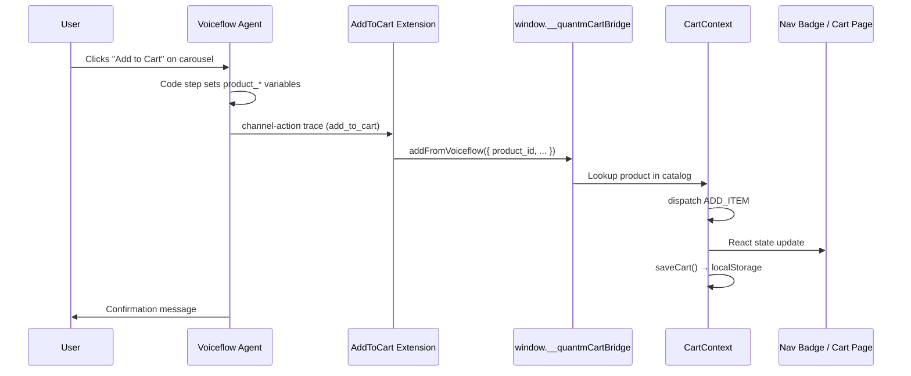

# Voiceflow Add to Cart — Implementation Plan

Integration plan for a Voiceflow chat agent that adds products to the Quant'M CortX cart via a **effect extension**, wired into the existing React cart (`CartContext` + `quantm-cart` localStorage).

**Voiceflow docs:** [Chat widget extensions](https://docs.voiceflow.com/documentation/deploy/widget/web-chat-extensions)

---

## Table of Contents

1. [Progress Checklist](#1-progress-checklist)
2. [Overview](#2-overview)
3. [Architecture](#3-architecture)
4. [Data Contract](#4-data-contract)
5. [Voiceflow Workflow Setup](#5-voiceflow-workflow-setup)
6. [Frontend Implementation](#6-frontend-implementation)
7. [Bridge Design](#7-bridge-design)
8. [File Structure](#8-file-structure)
9. [Configuration](#9-configuration)
10. [Testing Checklist](#10-testing-checklist)
11. [Troubleshooting](#11-troubleshooting)
12. [Future Enhancements](#12-future-enhancements)

---

## 1. Progress Checklist

### Frontend (this repo)

- [x] Define Voiceflow payload types (`src/types/voiceflow.ts`)
- [x] Create cart bridge utility (`src/integrations/voiceflow/cartBridge.ts`)
- [x] Create Add to Cart effect extension (`src/integrations/voiceflow/addToCartExtension.ts`)
- [x] Expose `window.__quantmCartBridge` from `CartContext`
- [x] Add `addFromVoiceflow()` to cart context API
- [x] Create `VoiceflowChat` component (loads widget + registers extension)
- [x] Mount `VoiceflowChat` in `App.tsx`
- [x] Add `VITE_VOICEFLOW_PROJECT_ID` env variable (`.env.example`)
- [ ] Manual end-to-end test with live Voiceflow project

### Voiceflow (configure in Voiceflow dashboard)

- [ ] Create variables: `product_id`, `product_name`, `product_price`, `product_quantity`
- [ ] Build carousel with "Add to Cart" buttons per product
- [ ] Code step sets product variables after button click
- [ ] Function step emits `channel-action` trace with `name: 'add_to_cart'`
- [ ] Confirmation message step after extension runs
- [ ] Test carousel → add to cart → badge updates on site

---

## 2. Overview

### Problem

Voiceflow effect extensions run as **vanilla JavaScript** outside React. Our cart lives in **React Context** with a specific `quantm-cart` localStorage shape. A naive extension writing to a separate `cart` key would desync the UI.

### Solution

```
Voiceflow Function (channel-action trace)
        ↓
AddToCart effect extension
        ↓
window.__quantmCartBridge.addFromVoiceflow(payload)
        ↓
CartContext dispatches ADD_ITEM (same reducer as ProductPage)
        ↓
localStorage updated + React UI re-renders (badge, cart page)
```

The extension does **not** write to localStorage directly. It delegates to the React cart bridge so one source of truth is preserved.

---

## 3. Architecture



### Why a window bridge?

| Approach | Pros | Cons |
|----------|------|------|
| Extension writes `localStorage` directly | Simple | Desyncs React state; wrong schema |
| CustomEvent only | Decoupled | Race if React not mounted |
| **`window.__quantmCartBridge`** ✅ | Same cart logic as UI; works once React mounts | Slight global coupling |

Effect extensions fire on user interaction, so React is always mounted by then.

---

## 4. Data Contract

### Voiceflow → Frontend payload

Emitted by the Voiceflow Function step inside `trace.payload.payload`:

| Field | Type | Required | Maps to |
|-------|------|----------|---------|
| `product_id` | string | Yes | `Product.ID` in `src/data/products.ts` |
| `product_name` | string | No* | Fallback title if ID not in catalog |
| `product_price` | number | No* | Fallback price if ID not in catalog |
| `product_quantity` | number | No | Cart quantity (default: `1`) |

\*The bridge **prefers the local catalog** when `product_id` matches. Voiceflow fields are fallbacks only.

### Product ID format

Use the same IDs as the site catalog, e.g. `"9648073015632"` (3D Contoured Sleep Mask). Voiceflow carousel buttons must set `product_id` to these values.

### Trace structure (must match extension `match`)

```javascript
{
  type: 'channel-action',
  payload: {
    name: 'add_to_cart',
    payload: {
      product_id: '9648073015632',
      product_name: '3D Contoured Sleep Mask',
      product_price: 7.99,
      product_quantity: 1
    }
  }
}
```

### Bridge response

```typescript
interface VoiceflowAddToCartResult {
  success: boolean;
  error?: 'PRODUCT_NOT_FOUND' | 'OUT_OF_STOCK' | 'BRIDGE_UNAVAILABLE' | 'INVALID_PAYLOAD';
  productId?: string;
  quantity?: number;
}
```

---

## 5. Voiceflow Workflow Setup

### Step 5.1 — Create variables

| Variable | Type | Default |
|----------|------|---------|
| `product_id` | string | — |
| `product_name` | string | — |
| `product_price` | number | — |
| `product_quantity` | number | `1` |

### Step 5.2 — Carousel with Add to Cart buttons

- Add a **Carousel** step with product cards.
- Each card button label: `"Add to Cart"`.
- Wire each button to a path that captures that product's data.

### Step 5.3 — Code step (set variables)

After each carousel button click:

```javascript
// Example: 3D Contoured Sleep Mask
product_id = "9648073015632"
product_name = "3D Contoured Sleep Mask"
product_price = 7.99
product_quantity = 1
```

Use the real IDs and prices from `src/data/products.ts`.

### Step 5.4 — Function step (emit trace)

**Name:** `Add To Cart Effect`  
**Input variables:** `product_id`, `product_name`, `product_price`, `product_quantity`  
**Paths:** `default` (no `listen` needed — effect runs silently)

```javascript
export default async function main(args) {
  const { product_id, product_name, product_price, product_quantity } = args.inputVars;

  return {
    trace: [{
      type: 'channel-action',
      payload: {
        name: 'add_to_cart',
        payload: {
          product_id,
          product_name,
          product_price,
          product_quantity: product_quantity || 1
        }
      }
    }],
    next: { path: 'default' }
  };
}
```

### Step 5.5 — Confirmation message

After the function step, add a **Speak** step:

> "I've added {product_name} to your cart! You can view your cart using the icon in the top navigation."

### Workflow diagram

```
Carousel "Add to Cart" click
        ↓
Code step (set product_* variables)
        ↓
Function step (channel-action / add_to_cart)
        ↓
Frontend extension → React cart
        ↓
Speak step (confirmation)
```

---

## 6. Frontend Implementation

### 6.1 Effect extension

File: `src/integrations/voiceflow/addToCartExtension.ts`

```typescript
const AddToCartExtension = {
  name: 'AddToCart',
  type: 'effect',
  match: ({ trace }) =>
    trace.type === 'channel-action' &&
    trace.payload?.name === 'add_to_cart',
  effect: ({ trace }) => {
    const payload = trace.payload?.payload;
    window.__quantmCartBridge?.addFromVoiceflow(payload);
  },
};
```

### 6.2 Cart bridge

File: `src/integrations/voiceflow/cartBridge.ts`

- Validate payload (`product_id` required).
- Resolve product from `products` catalog by `product_id`.
- If found → use full `Product` (image, stock, price).
- If not found → build minimal product from Voiceflow fields (degraded mode).
- Return structured result for logging.

### 6.3 CartContext integration

- Add `addFromVoiceflow(payload)` method.
- Register `window.__quantmCartBridge` in `useEffect`.
- Dispatch existing `ADD_ITEM` action (reuse stock limits).

### 6.4 VoiceflowChat component

File: `src/components/VoiceflowChat.tsx`

- Reads `import.meta.env.VITE_VOICEFLOW_PROJECT_ID`.
- Dynamically loads `https://cdn.voiceflow.com/widget-next/bundle.mjs`.
- Calls `window.voiceflow.chat.load()` with `assistant.extensions: [AddToCartExtension]`.
- Renders nothing (widget injects its own UI).

### 6.5 App integration

```tsx
// App.tsx
<VoiceflowChat />
```

Placed inside `CartProvider` (via `main.tsx`) so the bridge is available when the widget loads.

---

## 7. Bridge Design

### Global API

```typescript
interface QuantmCartBridge {
  addFromVoiceflow: (payload: VoiceflowAddToCartPayload) => VoiceflowAddToCartResult;
}

declare global {
  interface Window {
    __quantmCartBridge?: QuantmCartBridge;
    voiceflow?: { chat: { load: (config: unknown) => void } };
  }
}
```

### Custom event (optional consumers)

After a successful add, dispatch:

```javascript
window.dispatchEvent(new CustomEvent('quantm:cart:updated', {
  detail: { source: 'voiceflow', productId, quantity }
}));
```

The nav badge and cart page already react via React Context; this event is for future analytics or third-party scripts.

### What we intentionally do NOT do

- Do not use a separate `localStorage` key (`cart`).
- Do not bypass stock validation.
- Do not require `listen: true` on the Voiceflow function (effect is fire-and-forget).

---

## 8. File Structure

```
src/
├── types/
│   └── voiceflow.ts                         # Payload + result types
├── integrations/
│   └── voiceflow/
│       ├── cartBridge.ts                    # Payload validation + product resolve
│       └── addToCartExtension.ts            # Effect extension definition
├── context/
│   └── CartContext.tsx                      # Bridge registration + addFromVoiceflow
├── components/
│   └── VoiceflowChat.tsx                    # Widget loader
└── App.tsx                                  # Mount VoiceflowChat

.env.example                                 # VITE_VOICEFLOW_PROJECT_ID=
VOICEFLOW-ADD-TO-CART.md                     # This file
```

---

## 9. Configuration

### Environment variable

Create `.env` in the project root:

```env
VITE_VOICEFLOW_PROJECT_ID=your_voiceflow_project_id_here
```

Get the project ID from Voiceflow → **Integrations** → **Web chat** → embed snippet.

If unset, `VoiceflowChat` does not load the widget (site works normally without chat).

### Widget registration (handled by `VoiceflowChat`)

```javascript
window.voiceflow.chat.load({
  verify: { projectID: import.meta.env.VITE_VOICEFLOW_PROJECT_ID },
  url: 'https://general-runtime.voiceflow.com',
  assistant: {
    extensions: [AddToCartExtension],
  },
});
```

---

## 10. Testing Checklist

### Frontend (local)

- [ ] Set `VITE_VOICEFLOW_PROJECT_ID` in `.env` and restart dev server
- [ ] Voiceflow widget appears on site
- [ ] `window.__quantmCartBridge` is defined after page load
- [ ] Manual bridge test in browser console:
  ```javascript
  window.__quantmCartBridge.addFromVoiceflow({
    product_id: '9648073015632',
    product_name: '3D Contoured Sleep Mask',
    product_price: 7.99,
    product_quantity: 1
  });
  ```
- [ ] Nav cart badge increments
- [ ] `/cart` shows the added item
- [ ] Refresh page → item persists

### Voiceflow end-to-end

- [ ] Carousel renders products
- [ ] "Add to Cart" sets variables correctly
- [ ] Function emits `channel-action` trace
- [ ] Extension matches trace (check browser console)
- [ ] Cart badge updates without page refresh
- [ ] Agent shows confirmation message
- [ ] Adding same product twice merges quantity
- [ ] Invalid `product_id` does not break chat flow

### Edge cases

- [ ] `product_quantity` omitted → defaults to 1
- [ ] Quantity capped at `inventoryQuantity`
- [ ] Bridge called before React mounts → returns `BRIDGE_UNAVAILABLE` (unlikely in practice)
- [ ] Widget loads without project ID → no errors, no widget

---

## 11. Troubleshooting

| Symptom | Likely cause | Fix |
|---------|--------------|-----|
| Widget doesn't appear | Missing `VITE_VOICEFLOW_PROJECT_ID` | Add to `.env`, restart `npm run dev` |
| Cart doesn't update | `product_id` doesn't match catalog | Use IDs from `src/data/products.ts` |
| Extension never fires | Trace `name` mismatch | Ensure function sends `name: 'add_to_cart'` |
| Debug logs trace but cart doesn't update | Multiple effect extensions registered | Voiceflow runs only the **first** matching extension — use one handler |
| Badge stuck at 0 | Bridge not registered | Confirm `CartProvider` wraps app in `main.tsx` |
| Console: bridge unavailable | Extension ran before React mount | Reload page; check component order |

### Debug extension match

In browser DevTools, watch for the function trace when clicking Add to Cart. The extension `match` requires:

```
trace.type === 'channel-action'
trace.payload.name === 'add_to_cart'
```

---

## 12. Future Enhancements

1. **Response extension carousel** — Render product picker inside chat (richer UX than Voiceflow native carousel).
2. **View cart effect** — `channel-action` with `name: 'view_cart'` → `navigate('/cart')`.
3. **Remove from cart effect** — Agent-assisted cart editing.
4. **Product search via agent** — Function returns catalog-filtered results.
5. **Analytics** — Listen to `quantm:cart:updated` for tracking.
6. **Backend sync** — POST cart to API when user accounts exist.

---

## Reference: Catalog product IDs

Use these in Voiceflow Code steps (from `src/data/products.ts`):

| Product | `product_id` |
|---------|----------------|
| 15 Pairs Magnetic Nasal Strips | `9648108536144` |
| 3D Contoured Sleep Mask | `9648073015632` |
| 3D Sleeping Eye Mask | `9648092873040` |
| Foot Massager | `9648102572368` |
| Silicone Nose Clips | `9648121577808` |
| Foreverlily Wireless Neck And Back Massager | `9643806654800` |
| Neck Shoulder Stretcher | `9643786338640` |

(See full list in `src/data/products.ts`.)

---

## Related docs

- [ADD-TO-CART.md](./ADD-TO-CART.md) — Site cart MVP implementation
- [Voiceflow extensions docs](https://docs.voiceflow.com/documentation/deploy/widget/web-chat-extensions)
